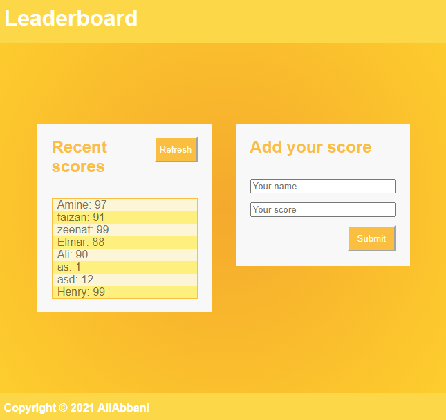

# Leaderboard

> Building A Leaderboard scores App

The leaderboard website displays scores submitted by different players. It also allows you to submit your score.

## Built With

- HTML
- CSS
- JavaScript

## Live Demo

[Live Demo Link](https://keen-hermann-3978d3.netlify.app/)

## Getting Started

### To get a local copy up and running follow these simple example steps.

- Clone the repo with `git clone git@github.com:aliabbani/Leaderboard.git`
- Open your terminal or command line
- Run `git clone` and paste the link
- Open the folder with your code editor
- Create a branch to work on
- Run `npm install`
- Run `npm run build`
- Run `npm run start` to launch the server.

### You can view the app using the 'live demo' above.
### To create your own game ID with this API (Using Postman App)

- Open your `Postman` App
- Enter this URL `https://us-central1-js-capstone-backend.cloudfunctions.net/api/games/`
- Change the action to POST
- Go to the Body tab, select raw and JSON as the format
- Paste this in the body field `{"name": "Your game name"}`
- Click send and you should get a result with the unique identifier e.g. `r9EiHY1wXBgG0IWX06By`
- Open the `index.js` file and replace the ID in the URL variable with your ID
- Save the file and launch the server, your recent scores list should be empty

## Author

👤 **Ali Abbani**
## Ali's Profile
- GitHub: [@githubhandle](https://github.com/aliabbani)
- Twitter: [@twitterhandle](https://twitter.com/aliabbani)
- LinkedIn: [LinkedIn](https://www.linkedin.com/in/ali-abbani-8b6246150/)

## 🤝 Contributing

Contributions, issues, and feature requests are welcome!

Feel free to check the [issues page](https://github.com/aliabbani/Leaderboard/issues).

## Show your support

Give a ⭐️ if you like this project!

## Acknowledgments

- A special thanks to Microverse for inspiring this project. We are indebted to you all at Microverse
- A special thanks goes to all our peers at Microverse for being there for us.

## 📝 License

This project is [MIT](./MIT.md) licensed.
